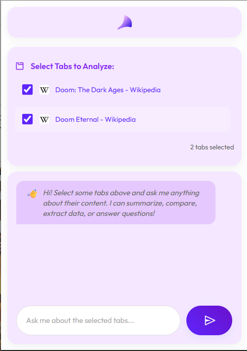

# Axed Tab Bot - Streamlining Browser Productivity

A browser extension that allows you to gather the content of multiple open tabs and then use an AI chatbot to ask questions and get insights based on that aggregated content. This project has been built for HackWithGujarat 2025 Hackathon hosted on Devfolio.com.

## ✨ Features

- **Multi-Tab Content Gathering**: Select multiple open tabs and automatically fetch their textual content.
- **AI Chatbot Interaction**: Ask specific questions or general queries about the combined content of your selected tabs.
- **Contextual AI Responses**: The AI chatbot provides answers and insights directly relevant to the gathered page content.
- **Clean UI**: Intuitive and modern user interface built purely with HTML, CSS, and JavaScript, without external libraries.
- **Error Handling**: Provides clear messages for issues like inaccessible tabs or API communication problems.

## 🚀 Installation

This extension can be loaded as an "unpacked" extension in Chromium-based browsers (Google Chrome, Microsoft Edge, Brave, etc.).

1.  **Download the project**:

    - Clone this repository: `git clone <repository_url>` (Replace `<repository_url>` with your actual repository URL if hosted, otherwise download the ZIP file).
    - Or, simply download the ZIP file of the project and extract it to a folder on your computer.

2.  **Open your browser's Extensions page**:

    - **Chrome**: Go to `chrome://extensions`
    - **Edge**: Go to `edge://extensions`
    - **Brave**: Go to `brave://extensions`

3.  **Enable Developer Mode**:

    - In the top-right corner of the Extensions page, toggle on "Developer mode".

4.  **Load the unpacked extension**:

    - Click the "Load unpacked" button that appears.
    - Navigate to the folder where you extracted/cloned the extension files (the folder containing `manifest.json`, `popup.html`, etc.) and select it.

5.  **Pin the extension (Optional but Recommended)**:

    - Once loaded, you'll see the "Axed Tab Bot" icon in your browser's toolbar. Click the puzzle piece icon (Extensions icon) and then pin the "Axed Tab Bot" to your toolbar for easy access.

6.  **IMPORTANT: Create the API key configuration file**:
    - In the extension's folder, create a file named `config.json`.
    - Add your Google Gemini API key in the following format:
    ```json
    {
      "apiKey": "YOUR_API_KEY_HERE"
    }
    ```
    - Save the file. The extension will use this key to access the AI service.

## 🖼️ Screenshots





## 💡 Usage

1.  **Open the Extension**: Click the "Axed Tab Bot" icon in your browser's toolbar.
2.  **Select Tabs**: In the "Select Tabs to Analyze" section, you will see a list of your currently open tabs. Check the boxes next to the tabs whose content you want the AI to analyze.
    - _Note_: Some browser-specific pages (like `chrome://` pages, `about:` pages, or local `file://` pages) cannot be read by extensions for security reasons and will be filtered out.
3.  **Ask Your Query**: In the chatbot section at the bottom, type your question into the input field.
4.  **Send Query**: Click the "Send" button or press `Enter`.
5.  **Get AI Response**: The AI will process your query based on the content of the selected tabs and display its response in the chat history.

## 🤖 AI Model

This extension utilizes the **Gemini API** (specifically, the `gemini-2.0-flash` model for efficient text generation) to power the AI chatbot. Your API key will be managed securely by the environment and is not hardcoded directly into the publicly visible JavaScript.
